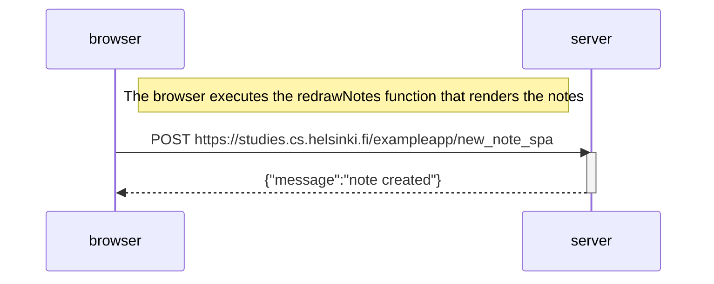

```mermaid
sequenceDiagram
    participant browser
    participant server

    Note right of browser: The browser executes the redrawNotes function that renders the notes
    browser->>server: POST https://studies.cs.helsinki.fi/exampleapp/new_note_spa
    activate server
    server-->>browser: {"message":"note created"}
    deactivate server
```
